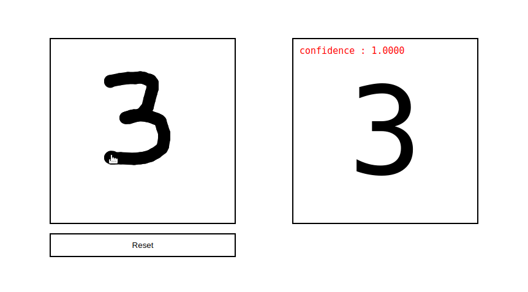

# Handwritten digits recognition

This a **Flask** web app to predict handwritten digits using a deep convolutional neural network built with **Keras** and trained on the **MNIST** dataset.



## Training the model

To re-train a different model or see the existing model, check the [training notebook](training.ipynb)

## Running the app locally

### Prerequisites

- Docker
- Docker Compose


### Installation

1. Clone the repo:

```
git clone https://github.com/ihebu/digit-recognizer.git
```

2. Navigate to the project directory:

```
cd digit-recognizer
```

3. Build the docker images 

```
docker-compose build
```

4. Start running the containers 

```
docker-compose up
```

### Usage

to use the app, simply go to [http://localhost](http://localhost)
